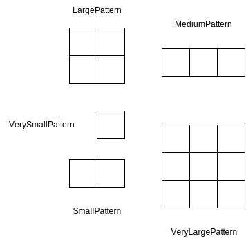

:pumldir: ./assets/puml

In questa sezione, si mostrano le scelte di design più critiche circa l'organizzazione della struttura del sistema e dei suoi componenti.

== Model

=== GameBoard

[#game-board-class-diagram]
.Diagramma delle classi che mostra le classi della GameBoard.
[plantuml, format="svg"]
----
include::{pumldir}/GameBoard.puml[]
----

La `GameBoard` è la parte cruciale del model dell'applicazione.
Parlerò delle classi principali che lo compongono e del loro ruolo.

- `GameBoard`: Contiene un riferimento alla `Board`, che a sua volta contiene la `Grid` e la direzione del
vento, insieme al mazzo di carte (`Deck`) e ai due giocatori. C'è anche un riferimento al `PlayerManager`,
che consente di gestire il turno dei giocatori.
Infine, contiene il numero del turno e la fase di gioco corrente.
Offre la possibilità di ottenere i giocatori, di gestirli (cambio turno), di determinare se qualche giocatore
ha vinto sull'altro, e di poter risolvere gli effetti di gioco (`IGameEffect`) tramite il metodo solveEffect racchiuso
nel Trait `GameBoardManager`.
- `Board`: Rappresenta la griglia di gioco e la direzione del vento. Offre metodi per verificare se una torre è in
fiamme e per generare configurazioni standard e di fine gioco della griglia.
- `Deck`: Gestisce il mazzo di carte, inclusa la miscelazione, la pesca di carte standard e speciali,
e la rigenerazione del mazzo.
- `Player`: Rappresenta un giocatore nel gioco, con il suo nome, le mosse effettuate, le carte in mano,
una carta extra opzionale e le posizioni delle torri.
- `PlayerToggle`: Gestisce il turno dei giocatori. Ad esempio per cambiare il turno verrà usato il metodo toggle.
- `GamePhase`: Enumera le diverse fasi del gioco, come la fase del vento, la fase di ridistribuzione delle carte,
la fase di gioco delle carte standard, ecc.

Componente fondamentale della `GameBoard` è la `Grid`, che gestisce la griglia di gioco.

[#grid-class-diagram]
.Diagramma delle classi che mostra le classi della Grid.
[plantuml, format="svg"]
----
include::{pumldir}/Grid.puml[]
----

La `Grid` è composta da tre parti fondamentali:

- Il Trait, che definisce l'interfaccia base per la griglia. Contiene i metodi per ottenere e impostare le celle
e i token.
- L'Object, che implementa il Trait `Grid` e offre metodi per creare le istanze, come quella vuota, standard o di fine gioco.
Contiene anche la costante per la dimensione della griglia. Le istanze sono definite in `GridDefinitions`, che contiene
le configurazioni.
- La classe `BasicGrid` è l'implementazione concreta del Trait `Grid` e ne definisce i metodi.

Allo scopo di essere creata la `Grid` utilizza la classe `GridBuilder` che permette di costruire la griglia in modo incrementale.

Attraverso i suoi metodi setNextCell e nextRow (poi utilizzati tramite alias + e -) è possibile procedere alla creazione.
Nell'Object `GridBuilder` vengono forniti dei metodi di configurazione e un DSL per facilitarne la costruzione.
Il DSL tiene conto dei simboli T,F,E per rappresentare i vari tipi di cella (Torre, Foresta e Eternal Fire).

La `Grid` contiene anche la classe `TowerPositionManager`, che permette di ottenere le posizioni delle celle torri basate sulla loro
posizione. Questo è utile per determinare se una torre è in fiamme e per effettuare i calcoli per il Bot.

Le Enumerazioni `Cell` e `ConcreteToken` definiscono rispettivamente :

- `Cell`: Le celle che possono essere posizionate sulla griglia, come la torre, la foresta e il fuoco eterno.
- `ConcreteToken`: I token che possono essere posizionati su una cella, come tagliafuoco, fuoco, acqua, reforest e empty.

I Token vengono definiti in un Trait con un identificativo ed un colore (per la rappresentazione grafica), ma poi utilizzano
la enumerazione che ne estende il Trait per definire i token concreti.

Come anticipato in precedenza, svolge il ruolo di gestione degli effetti di gioco il Trait
`GameBoardManager`.
È infatti responsabile di risolvere i vari tipi di effetti di gioco, che sono:

- `PhaseEffect`
- `HandEffect`
- `PatternEffect`
- `GameBoardEffectSolver`
- `WindUpdateEffect`

Molti di questi solver vengono gestiti in altre parti dell'applicazione, come per la fase,
per la hand, per il pattern e per il wind update.

Una volta risolto l'effetto, il `GameBoardManager` ritorna la `GameBoard` aggiornata.

=== Player

[#player-class-diagram]
.Diagramma delle classi che mostra le classi del Player.
[plantuml, format="svg"]
----
include::{pumldir}/Player.puml[]
----

Per quanto riguarda la modellazione dei giocatori, visto la possibilità di avere un giocatore umano e un giocatore bot, si è deciso di modellare il giocatore come un Trait *Player* che contiene i metodi comuni tra i due tipi di giocatori.
Nello specifico il Trait Player contiene le seguenti informazioni:

- *name*: Il nome del giocatore
- *moves*: La lista delle mosse effettuate dal giocatore
- *hand*: La lista delle carte in mano al giocatore
- *extraCard*: Una carta extra che il giocatore può avere in mano
- *towerPositions*: Un set di posizioni delle proprie torri

Inoltre sono presenti una serie di Option per memorizzare le ultime azioni effettuate dal giocatore.

Il Trait inoltre implementa i metodi comuni tra i due tipi di giocatori come:

- *drawCardFromDeck*: Metodo che permette di pescare una carta dal mazzo ed inserirla nell'apposito slot della mano del giocatore popolando la hand in caso di carte normali o l'extraCard in caso di carte speciali

- *playCard*: Metodo che permette di giocare una carta dalla mano del giocatore e restituisce il giocatore aggiornato e la carta giocata

- *logMove*: Metodo che permette di loggare una mossa effettuata dal giocatore

- *discardCards*: Metodo che permette di scartare una o più carte dalla mano del giocatore

- *updatePlayer* di aggiornare le informazioni del giocatore in base alle mosse effettuate.

Il Trait Player è esteso da tre classi:

- *Person*: Rappresenta un giocatore umano che non presenta particolari comportamenti aggiuntivi

- *Bot* e *ThinkingPlayer*: Che vanno a rappresentare il giocatore bot.

=== Bot

Il Bot oltre a contenere le informazioni del giocatore, contiene un riferimento al *BotBehaviour* che rappresenta il comportamento del bot e un riferimento all'*BotSubject* che rappresenta l'observable del bot utilizzato per interagire con i componenti esterni simulando le azioni gestite tramite gli handler grafici.
Inoltre per reagire ai cambi stato del gioco, viene usato il metodo *think* che permette al bot di effettuare le azioni necessarie per il proprio turno.

Tramite il trait *ThinkingPlayer* vengono implementati i metodi per la gestione delle fasi del turno e delle azioni da compiere in base alla fase del turno.
Più nello specifico vengono implementati i metodi:

- *thinkForWindPhase*: Metodo che permette al bot di piazzare un token fuoco sulla griglia in base alla direzione del vento.

- *thinkForWaitingPhase*: Metodo che permette al bot di decidere se giocare una carta o scartare e pescare

- *thinkForRedrawCardPhase*: Metodo che permette al bot di scartare e pescare fino a 5 carte dalla propria mano

- *thinkForPlayStandardCardPhase*: Metodo che permette al bot di giocare una carta dalla propria mano

- *thinkForDecisionPhase*: Metodo che permette al bot di decidere terminare il turno o giocare una carta speciale

- *thinkForPlaySpecialCardPhase*: Metodo che permette al bot di giocare una carta speciale dalla propria mano

A supporto dei metodi di think, è stato implementato il trait *IMakeDecision* che contiene i metodi per filtrare le carte in base alla decisione e per verificare la presenza di token fuoco o fire break sulla griglia.

Ogni metodo di think presenta un'implementazione specifica per il bot che permette di gestire le azioni in modo automatico.
Nel dettaglio:

=== thinkForWindPhase
Per permettere il piazzamento di un token fuoco sulla griglia in base alla direzione del vento, vengono designate come torri target le due torri avversarie e modellata la direzione del vento riproducendo una carta.
Viene poi lasciata la computazione della posizione del token fuoco alla teoria prolog LogicSolverManager.

=== thinkForWaitingPhase
Per definire se passare alla fase di PlayStandardCard o RedrawCard, vine utilizzata la teoria Prolog AttackDefenseTheory per determinare se passare in fase di attacco o difesa, in base alla decisione presa vengono analizzate le carte presenti in mano e scelte le azioni da compiere.
Se non sono presenti carte che possono essere giocate, il bot passa alla fase di RedrawCard.

=== thinkForRedrawCardPhase
Per scartare e pescare fino a 5 carte dalla propria mano, il bot scarta le carte che non sono utili per la fase di gioco corrente e pesca fino a 5 carte.

=== thinkForPlayStandardCardPhase
Per giocare una carta dalla propria mano, vengono filtrate le carte in base alla decisione presa in fase di Waiting e scomposte in effetti singoli visto che alcune carte possono avere sia effetti difensivi che offensivi.
Una volta ottenuta la mappa dei relativi id carta ed effetto, viene utilizzata la teoria Prolog LogicSolverManager per determinare la carta da giocare e la posizione in cui giocarla.

=== thinkForDecisionPhase
Per decidere se terminare il turno o giocare una carta speciale, il bot verifica la presenza token fuoco nelle porpoise torri.

=== thinkForPlaySpecialCardPhase
Se presente la carta speciale nella mano del bot viene calcolata la posizione in cui piazzarla tramite la teoria Prolog LogicSolverManager.

Ogni metodo di think chiama a sua volta *onUpdateGamePhaseRequest* per notificare la view del cambio di fase e *handleMoveAndApplyEffect* per applicare gli effetti delle mosse.

=== Effetti

Di seguito si discute la rappresentazione e la gestione degli effetti sulla gameboard.
Il sistema si basa sui concetti di effetto e risolutore. Gli effetti esprimono i cambiamenti che sono applicati alla gameboard e incapsulano i parametri necessari per effettuarlo.
I risolutori permettono di risolvere gli effetti e di comporre le modifiche al campo di gioco tramite catene di funzione higher order.
Questo approccio permette di ottenere un sistema flessibile, espandibile e modulare, che facilita l'espansione o la modifica degli effetti senza cambiare la struttura principale del gioco.

In <<game-effect-class-diagram>> sono mostrati i principali effetti di gioco, ovvero:

- *HandEffect*: include i cambiamenti alla mano del giocatore, relativi allo scartare, pescare o giocare carte.
- *PatternEffect*: include i cambiamenti alla griglia, relativi al piazzamento di pattern di token, come fuoco e tagliafuoco.
- *MoveEffect*: include la registrazione delle mosse dei giocatori, relative ad esempio alla scelta di carte da giocare o ripescare.
- *PhaseEffect*: consente la gestione dei cambiamenti della fase di gioco.
- *GameBoardEffect*: rappresenta una sorta di effetto "terminale", ovvero si trova al termine di una catena di funzioni e rappresenta il risultato della mossa di un giocatore. Incapsula la gameboard aggiornata.

[#game-effect-class-diagram]
.Diagramma delle classi che rappresenta i principali effetti di gioco.
[plantuml, game-effect, format="svg"]
----
@startuml
hide empty members
skinparam shadowing false

class HandEffect << (E, orange) >>

class PatternEffect << (E, orange) >>

class MoveEffect << (E, orange) >>

class PhaseEffect << (E, orange) >>

class IGameEffect << (T, lightblue) >>

class GameBoardEffect

HandEffect      --> IGameEffect: extends
PatternEffect   --> IGameEffect: extends
MoveEffect      --> IGameEffect: extends
PhaseEffect     --> IGameEffect: extends
GameBoardEffect --> IGameEffect: extends
@enduml
----

In <<solver-types-class-diagram>> sono mostrati i principali risolutori, ovvero:

- *ISolveGameEffect*: è un'interfaccia generica che riceve in input un effetto e lo traduce in un altro effetto.
- *GameEffectSolver*: rappresenta un'istanza concreta di risolutore che è utilizzata nell'applicazione come intermediario tra altri risolutori o come terminale di una catena di funzioni nel caso restituisca un `GameBoardEffect`.
- *LogicEffectSolver*: è l'istanza di un risolutore specializzata nella restituzione di effetti logici, ovvero degli effetti che saranno poi usati per il calcolo dei pattern.
- *PatternEffectSolver*: è l'istanza di un risolutore specializzata nella restituzione del risultato del calcolo dei pattern.

[#solver-types-class-diagram]
.Diagramma delle classi che rappresenta i risolutori di logica.
[plantuml, solver-types, format="svg"]
----
@startuml
hide empty members
skinparam shadowing false
left to right direction

class ISolveGameEffect as "ISolveGameEffect[InputEffect <: IGameEffect, OutputEffect <: IGameEffect]" << (T, lightblue) >>

class GameEffectSolver as "GameEffectSolver[InputEffect <: IGameEffect, OutputEffect <: IGameEffect]"

class LogicEffectSolver as "LogicEffectSolver[CardEffect <: ICardEffect]"

class PatternEffectSolver as "PatternEffectSolver[GameBoardEffect, PatternEffect | GameBoardEffect]"

GameEffectSolver    --> ISolveGameEffect: extends
LogicEffectSolver   --> ISolveGameEffect: extends
PatternEffectSolver --> ISolveGameEffect: extends
@enduml
----

=== Carte
:pumldir: ./assets/puml
:srcdir: ../
:xrefstyle: short
:figure-caption: Figura
:listing-caption: Listato

Di seguito si discute la rappresentazione e la gestione delle carte e dei relativi effetti sul campo di gioco.

Grazie al sistema degli effetti e dei risolutori è stato possibile facilitare l'espansione o la modifica degli effetti senza cambiare la struttura principale del gioco.

Come si può osservare in <<card-types-class-diagram>>, gli effetti delle carte sono stati suddivise in due categorie: standard e speciali. Esistono cinque tipi di effetti, uno per ogni tipologia di carta del gioco:

- *Secchio*: effetto speciale che fa riferimento alle uniche carte che permettono di rimuovere dei token fuoco che si trovano nell'area di una torre;
- *Tagliafuoco*: effetto standard che permette di aggiungere o rimuovere dei tagliafuoco dal campo di gioco. I tagliafuoco impediscono di piazzare dei token fuoco nella posizione in cui si trovano.
- *Fuoco*: effetto standard utilizzato per piazzare dei token fuoco.
- *Acqua*: effetto standard utilizzato per rimuovere i token fuoco che non si trovano nei confini delle torri.
- *Vento*: effetto standard che permette di modificare la direzione del vento o di piazzare un token fuoco.

[#card-types-class-diagram]
.Diagramma delle classi che rappresenta i risolutori di logica.
[plantuml, solvers, format="svg"]
----
@startuml
hide empty members
skinparam shadowing false
left to right direction

class BucketEffect << (E, orange) >>
class FirebreakEffect << (E, orange) >>
class FireEffect << (E, orange) >>
class WaterEffect << (E, orange) >>
class WindEffect << (E, orange) >>

class ISpecialCardEffect << (T, lightblue) >>
class IStandardCardEffect << (T, lightblue) >>
class ICanBeDiscarded << (T, lightblue) >>
class ICannotBeDiscarded << (T, lightblue) >>
class ICanBePlayedAsExtra << (T, lightblue) >>

class ICardEffect << (T, lightblue) >>

IStandardCardEffect --> ICardEffect: extends
ISpecialCardEffect  --> ICardEffect: extends

IStandardCardEffect --> ICanBeDiscarded: extends
ISpecialCardEffect  --> ICannotBeDiscarded: extends
ISpecialCardEffect  --> ICanBePlayedAsExtra: extends

BucketEffect    --> ISpecialCardEffect: extends
FirebreakEffect --> IStandardCardEffect: extends
FireEffect      --> IStandardCardEffect: extends
WaterEffect     --> IStandardCardEffect: extends
WindEffect      --> IStandardCardEffect: extends
----

A ciascuna tipologia sono associate delle proprietà specifiche tramite appositi tratti. In particolare le carte standard possono essere scartate, al contrario delle carte speciali. Inoltre le carte speciali possono essere giocate in aggiunta ad altre azioni del turno.

Esistono due tipologie di effetti che possono essere associate agli effetti di una carta tramite un risolutore: quelli che richiedono di scegliere tra quelli possibili un pattern da applicare, che estendono `PatternLogicEffect`, e quelli che richiedono di effettuare scelte di altro genere, che estendono `IGameChoiceEffect`. La gerarchia completa è mostrata in <<effect-types-class-diagram>>. Si osserva che `IGameChoiceEffect` è utilizzato per rappresentare gli effetti di cambiamento della direzione del vento, ovvero `WindUpdateEffect`.

[#effect-types-class-diagram]
.Diagramma delle classi che rappresenta i risolutori di logica.
[plantuml, solvers, format="svg"]
----
@startuml
hide empty members
skinparam shadowing false

class IGameEffect << (T, lightblue) >>
class IGameChoiceEffect << (T, lightblue) >>
class WindUpdateEffect << (E, orange) >>
class ILogicEffect << (T, lightblue) >>
class PatternLogicEffect

IGameChoiceEffect  --> IGameEffect: extends
ILogicEffect       --> IGameEffect: extends
WindUpdateEffect   --> IGameChoiceEffect: extends
PatternLogicEffect --> ILogicEffect: extends
----

In <<pattern-types>> sono mostrati i possibili pattern riportati dalle carte, che indicano come sono applicati i token sulla griglia.

[#pattern-types]
.Rappresentazione delle tipologie di pattern della griglia.

Gli effetti di applicazione dei pattern delle carte possono essere suddivisi in due categorie principali: effetti difensivi ed effetti offensivi.
Come si osserva in <<logic-effect-types-class-diagram>>, entrambe le tipologie di effetti estendono `ILogicComputation`, dato che incapsulano i parametri richiesti per il calcolo in Prolog.
Ciascuna `ILogicEffect` può essere associato a uno o più di queste computazioni, a seconda della complessità dell'effetto logico associato a una carta.

[#logic-effect-types-class-diagram]
.Diagramma delle classi che rappresenta i risolutori di logica.
[plantuml, solvers, format="svg"]
----
@startuml
hide empty members
skinparam shadowing false

class DefensiveEffect
class OffensiveEffect

class ILogicComputation << (T, lightblue) >>
class ILogicEffect << (T, lightblue) >>

DefensiveEffect --> ILogicComputation: extends
OffensiveEffect --> ILogicComputation: extends
ILogicEffect *-- ILogicComputation
----

Ad esempio in <<fire-effect-listing>> è riportata la definizione delle carte fuoco.
Si osserva l'utilizzo di una enumerazione per associare al tipo di effetto il relativo codice, impiegato in fase di lettura del file delle stringhe in inglese per popolare il titolo e la descrizione di ciascuna carta.

Ciascuna effetto di una carta è poi associato a un ulteriore effetto che definisce i parametri necessari per la sua risoluzione logica, tramite un metodo che funge da risolutore, di tipo `LogicEffectSolver`.

[#fire-effect-listing]
.Frammento di codice relativo alla dichiarazione dei tipi di carta fuoco e dei relativi effetti logici.
[source, scala]
----
include::../scala/it/unibo/model/effect/card/FireEffect.scala[tags=fireEffect]
----

Per effettuare l'associazione tra l'effetto di una carta e i parametri necessari per il calcolo dei possibili punti di applicazione del relativo pattern si utilizza una la given mostrata in <<given-logic-card-effect>>.

[#given-logic-card-effect]
.Frammento di codice relativo alla
[source, scala]
----
include::../scala/it/unibo/model/effect/core/ICardEffect.scala[tags=contextualLogicEffect]
----

=== Turno
==== Divisione del turno da regolamento ufficiale
Una partita è composta da una serie di turni, a sua volta il turno viene suddiviso in due parti fondamentali ed una facoltativa che sono:

. Il vento diffonde le fiamme: __Scegli uno spazio vuoto il cui bordo sia adiacente, nella direzione in cui il vento sta soffiando, ad
una Gemma Fuoco o alla Fiamma Eterna e posiziona una Gemma Fuoco su di esso. Due spazi
sono adiacenti se si toccano su uno dei 4 lati, mai in diagonale__.

. Esegui un’Azione dalla Torre (solo una delle due seguenti azioni): __Gioca una Carta dalla tua mano ed esegui l’azione indicata su di essa . Una volta che l’Azione è finita, metti la Carta nella pila degli
scarti e pesca una nuova Carta dal mazzo.
Oppure scarta e pesca fino a 5 Carte dalla tua mano. Dovresti sempre avere cinque Carte in mano
una volta che hai finito il tuo turno. Nota: I secchi non fanno parte della tua mano. __

* Azione Addizionale Facoltativa: __In qualsiasi momento durante il tuo turno puoi giocare il tuo
Secchio in aggiunta al resto del tuo turno __

==== Modellazione della divisione del turno

[#phases-turn]
.Diagramma degli stati delle fasi di un turno
image::assets/images/TurnStates.svg[align=center]

Per la gestione delle fasi del turno ed una migliore integrazione con il modello di gioco, si è deciso di modellare il turno come una macchina a stati finiti.
Nello specifico il turno è composto da 8 stati:

* *WindPhase* (Stato iniziale) : Fase iniziale del turno che permette il piazzamento di un token fuoco sulla griglia in base alla direzione del vento

* *WaitingPhase*: Fase di stallo successiva alla fase iniziale, in attesa che il giocatore scelga se giocare una carta o scartare e pescare

* *PlayStandardCardPhase*: Fase in cui il giocatore gioca una carta dalla propria mano

* *RedrawCardPhase*: Fase in cui il giocatore scarta e pesca fino a 5 carte dalla propria mano

* *DecisionPhase*: Fase prettamente logica utilizzata per determinare il passaggio di fase successivo basandosi sulla presenza o non di carte speciali nella mano del giocatore

* *PlaySpecialCardPhase*: Fase in cui il giocatore gioca una carta speciale dalla propria mano (Bucket card)

* *EndTurnPhase*: Fase finale del turno nella quale viene preparato il turno successivo

* *EndGamePhase* (Stato finale): Fase finale della partita

La transizione da uno stato all'altro è determinata dalle azioni compiute dal giocatore gestite tramite handler specifici che vengono attivati e disattivati a livello di View in base allo stato attuale. A supporto degli handler è stato implementato il Trait *PhaseManager* che permette di automatizzare le azioni a livello di model per le transizioni di stato non dipendenti dal giocatore.

=== Prolog

L'impiego della programmazione logica ha permesso di esprimere dichiarativamente regole e vincoli
per il calcolo dei possibili punti di applicazione dei pattern delle carte sulla griglia e per
consentire al bot di prendere decisioni in base allo stato della board e alla propria mano.

La scelta di un approccio risolutivo basato sulla programmazione logica ha permesso di esprimere in modo
conciso e facilmente componibile ed estendibile le regole di gioco e la logica del bot.

La `GridTheory` è la classe che rappresenta la logica per la costruzione
di una teoria Prolog basata sulla griglia di gioco nella sua interezza.

Essa raggruppa vari tipi di iteratori, come quello delle celle, dei pattern, delle direzioni,
dei delta delle direzioni, e infine li combina tutti in uno unico per poterlo passare a Prolog.

Essa permette di rappresentare la situazione di gioco nella sua interezza allo scopo
di compiere vari calcolo, come quello della PatternComputation o delle decisioni del Bot.

[#grid-theory-prolog]
.Frammento di codice Prolog che mostra come è costruita la teoria relativa alla griglia di gioco.
[source, prolog]
----
cell((0,0),t).
cell((0,1),t).
cell((0,2),w).
cell((0,3),w).

cell((1,0),t).
cell((1,1),w).
cell((1,2),w).
cell((1,3),w).

cell((2,0),w).
cell((2,1),w).
cell((2,2),ef).
cell((2,3),ef).

cell((3,0),w).
cell((3,1),w).
cell((3,2),w).
cell((3,3),w).

token((0,2),f).

numRows(4).
numCols(4).

pattern((0,0),f,1).
pattern((0,1),f,1).

directions([north,south,east,west], 1).
deltas([(-1,0),(1,0),(0,1),(0,-1)], 1).
----

Qui sopra è raffigurato l'esempio della GridTheory in un caso ridotto, in cui la griglia sarebbe
grande 4x4, con due pattern e un token piazzato.

==== Decisione del Bot Attacco/Difesa

La parte di Prolog relativa alla decisione di Attacco/Difesa è stata implementata
per determinare quale sia la strategia migliore per il bot da adottare in base alla situazione
della griglia di gioco.
A questo scopo, trova la torre più vicina al fuoco, utilizzando la distanza di Manhattan.

La teoria Prolog che viene costruita su Scala è la `AttackDefenseTheory` e contiene i seguenti elementi:
- la griglia di gioco
- il set delle posizioni torre del giocatore
- il set delle posizioni torre dell'avversario
- il `botBehaviour`, cioè un oggetto che rappresenta il comportamento del bot tramite il `Bias`

Allo scopo di ottenere le celle della griglia di gioco, viene utilizzato il Trait `GridCellsProvider`.
La teoria ottiene gli iteratori delle celle di gioco e gli iteratori delle posizioni delle torri, combinandoli poi in un iteratore unico.
Dopo di chè viene aggiunta anche la variabile di bias e i solver necessari al calcolo.

L'algoritmo è integrato con Scala per delineare poi la strategia.
Definirò ora le parti cruciali del codice Prolog che consentono di eseguire questo calcolo:

- `closest_tower_to_fire/1`: torva la torre più vicina al fuoco calcolando le distanze per
le proprie torri e per le torri avversarie. A questo scopo viene utilizzata min_distance_to_fire/3.
Allo scopo di influenzare la decisione strategica del bot viene introdotto un *Bias* che permette di dare più peso alle torri avversarie
rispetto a quelle proprie o viceversa. Questo bias viene
aggiunto alla distanza delle torri del giocatore e influenza la sua decisione.

- `min_distance_to_fire/3`: trova la distanza minima tra un insieme di posizioni delle torri e qualsiasi cella fuoco, restituendo
la posizione della torre più vicina.
Le distanze vengono calcolate tramite la funzione manhattan_distance/2.
Allo scopo di trovare le distanze minime vengono utilizzate le funzioni min_member che data una tupla
restituiscono le distanze minime in una lista di tuple.

La `closest_tower_to_fire` ritorna la torre più vicina, che poi Scala, determinandone il proprietario, utilizzerà per decidere la strategia da adottare.

==== AvailablePatterns e PatternToPlay

Per fornire al bot le informazioni necessarie a decidere che carta giocare e in che posizione specifica
della griglia applicare il pattern è stata implementata la generazione procedurale di una serie di
teorie che codificano lo stato della board.

partendo dalla teoria di calcolo dei pattern disponibili per una carta
integrandola con la posizione delle torri da bersagliare e di utility che permettono di eseguire una
ricorsione tra torri e pattern per definire la posizione migliore su cui piazzare il pattern.
viene quindi infine composta da
TODO
La teoria è formata dai seguenti componenti:

* *GridTheory*: che contiene ricostruisce la griglia di gioco in prolog
* *tower_position*: che contiene le posizioni delle torri
* *ManhattanSolver*: che permette di calcolare la distanza di manatthan tra due punti
* *ConcatListTheory*: che permette di concatenare liste in modo ricorsivo
* *AllCardResultTheory*: che permette di realizzare una teoria prolog dinamica componendo i risultati di tutti i pattern disponibili per ogni carta passata in una lista unica
* *CardChoserSolver*: che permette di effettuare una ricorsione su torri e pattern per definire quale sia il piu vicino alla torre e quindi il migliore da giocare
* *CardSolver* e *BaseSolver*: che permettono di risolvere gli effetti delle carte in base alla griglia di gioco e ottenere tutti i pattern disponibili per una carta

La composizione di questa teoria in modo dinamico in base alle carte passate permette di ottenere una teoria prolog che si adatta alla situazione di gioco e permette di ottenere una soluzione ottimale per il bot.

A seguito verrà descritto il codice prolog che permette di risolvere la scelta del pattern da giocare.

===== CardSolver e BaseSolver
Permettono la risoluzione degli effetti delle carte in base alla griglia di gioco e di ottenere tutti i pattern disponibili per una carta.
BaseSolver implementa una serie di metodi prolog che permettono di avere i pattern disponibili basandosi sulla griglia e i token presenti ricreando le forme geometriche dei pattern presenti sulle carte originali poi composti da ogni effetto specifico.

Un esempio di risoluzione degli effetti delle carte è il seguente:
Presupponendo di dover risolvere una carta di tipo *SmokeJumper*, il predicato *smoke_jumper/3* permette di ottenere tutti i pattern disponibili per la carta.

=== `smoke_jumper/3`
Return all the available application points of the given pattern that are computed from the set of points that are fire tokens on woods or tower cells, checking the central point of the 3x3 pattern, computed with the offset (-1, -1).
[source,prolog]
----
smoke_jumper(R, CardId, EffectId) :- match_if_both_token_and_cell(Coords, [w, t], [f]), compute_pattern_with_offset((-1, -1), Coords, R, _, CardId, EffectId).
----
Questa regola identifica i punti di applicazione disponibili per un pattern che rappresenta Smoke Jumper. Il pattern viene applicato se il punto centrale del pattern 3x3, calcolato con l'offset (-1, -1), è un token di fuoco su celle di tipo bosco o torre.

*CardSolver*, *BaseSolver* e *GridTheory* sono quindi utilizzati combinati come unica teoria per il calcolo dei pattern disponibili per ogni carta in fase di piazzamento, permettendo quindi un highlight delle possibili posizioni sulla griglia di gioco.

==== CardChoserSolver

==== `main/1`
[source,prolog]
----
main(R) :-
    get_all_cards_result(AllResults),
    findall(TowerPos, tower_position(TowerPos), TowerPositions),
    find_closest_to_all_towers(AllResults, TowerPositions, R).
----
Identifica il pattern piu vicino alla torre.

==== `find_closest_to_all_towers/3`
[source,prolog]
----
find_closest_to_all_towers([],_,([],_)):- !.

find_closest_to_all_towers(AllResults, [Tower], Closest):-
    find_closest(AllResults, Tower, Closest, ClosestDist, MinDistTmp).

find_closest_to_all_towers(AllResults, [Tower1, Tower2 | RestTowers], Closest):-
    find_closest(AllResults, Tower1, Closest1, ClosestDist1, MinDistTmp),
    find_closest(AllResults, Tower2, Closest2, ClosestDist2, MinDistTmp),
    (ClosestDist1 < ClosestDist2 ->
        find_closest_to_all_towers(AllResults, [Tower1 | RestTowers], Closest),
        Closest = Closest1
    ;
        find_closest_to_all_towers(AllResults, [Tower2 | RestTowers], Closest),
        Closest = Closest2
    ).
----
Esegue una ricorsione per ogni torre identificando il pattern e la distanza minima da ogni torre.

==== `find_closest/5`
[source,prolog]
----
find_closest([(Coords, CardId)], TowerPos, (Coords, CardId),  MinDistTmp, MinDistTmp) :- !.

find_closest([(Coords1, CardId1), (Coords2, CardId2) | Rest], TowerPos, Closest, ClosestDist, MinDistTmp) :-
    find_min_distance(Coords1, TowerPos, MinDist1),
    find_min_distance(Coords2, TowerPos, MinDist2),
    (MinDist1 < MinDist2 ->
        find_closest([(Coords1, CardId1) | Rest], TowerPos, Closest, ClosestDist, MinDist1)
    ;
        find_closest([(Coords2, CardId2) | Rest], TowerPos, Closest, ClosestDist, MinDist2)
    ).

----
==== `find_min_distance/3`
[source,prolog]
----
find_min_distance([(X,Y,T)], TowerPos, MinDist) :-
    manhattan_distance((X,Y), TowerPos, MinDist).

find_min_distance([(X1,Y1,T1), (X2,Y2,T2) | Rest], TowerPos, MinDist) :-
    manhattan_distance((X1,Y1), TowerPos, Dist1),
    manhattan_distance((X2,Y2), TowerPos, Dist2),
    (Dist1 < Dist2 ->
        find_min_distance([(X1,Y1,T1) | Rest], TowerPos, MinDist)
    ;
        find_min_distance([(X2,Y2,T2) | Rest], TowerPos, MinDist)
    ).
----
Esplora tutta la lista di pattern e per ognuno esplora tutte le posizioni contenute nel pattern per identificare quale sia il piu vicino alla torre definita.

Per far si che  *get_all_cards_result(AllResults)* potesse essere eseguito per un numero variabile di carte è stata implementata la classe *AllCardResultTheory* che permette di concatenare i risultati di tutti i pattern disponibili per ogni carta realizzando una lista unica tramite *ConcatListTheory*.

==== `concat_lists/2`
[source,prolog]
----
%Base case
concat_lists([], []).

%Recursive case
concat_lists([List | Rest], R):-
    concat_lists(Rest, RestResult),
    append(List, RestResult, R).
----
Il predicato `concat_lists/2` concatena una lista di liste in una singola lista.
cosi da poter aver un unico risultato per tutte le carte passate.

==== Esempio di composizione della teoria dinamica per 2 carte
[source,prolog]
----
get_all_cards_result(R) :-
    findall((_2392719, 44), smoke_jumper(_2392719,44,0), R44),
    findall((_2392720, 41), water(_2392720,41,0), R41),
    concat_lists([R44, R41], R).
----

== View

=== Inizializzazione e GameComponent

Il `GameComponent` rappresenta la radice della gerarchia di componenti JavaFX che forma la GUI mostrata all'utente durante le fasi di gioco.

[#game-component-class-diagram]
.Diagramma delle classi dei componenti che formano la GUI durante le fasi di gioco.
[plantuml, game-component, format="svg"]
----
include::{pumldir}/game.component.puml[]
----

In <<game-component-class-diagram>> è mostrata l'organizzazione dei componenti di gioco. Si osserva che i tre principali componenti sono la barra laterale, la griglia e la mano del giocatore.

La barra laterale è composta da diversi sotto-componenti, ovvero:

- *GameInfoComponent*: riporta le informazioni sul numero del turno, sul giocatore corrente e sullo stato di gioco.
- *DeckComponent*: permette di avviare, confermare o cancellare la procedura di ripescaggio delle carte, utilizzando l' InternalViewSubject per comunicare con le api di HandComponent.
- *WindRoseComponent*: mostra la direzione del vento corrente e permette di cambiarla se si gioca una carta vento.
- *DiceComponent*: permette di aggiornare in modo pseudocasuale la direzione del vento.

=== Griglia di gioco

[#grid-component-class-diagram]
.Diagramma delle classi dei componenti utilizzati per la griglia
[plantuml, format="svg"]
----
include::{pumldir}/GridView.puml[]
----

I componenti fondamentali della parte di view che gestisce la griglia sono:

- `GridComponent`: è il componente principale che gestisce la griglia di gioco. In particolare, ne gestisce
l'inizializzazione tramite `GridInitializer` che crea l'insieme delle celle `GridSquare` associandole agli handler
gestiti da `GridEventHandler`. Inoltre, si occupa di aggiornare la griglia in base alla fase di gioco e alle posizioni
attuali delle torri.

- `GridEventHandler`: è il componente che coordina gli eventi di click e hover sulla griglia. Utilizza altre due classi:
`GridClickHandler` e `GridHoverHandler` per gestire rispettivamente gli eventi di click e hover, a cui passa tramite given
la squareMap, cioè la mappa delle celle della griglia, e gridState, che mantiene lo stato della griglia.

- `GridClickHandler`: si focalizza sulla gestione dei click sulla griglia, eseguendo azioni specifiche in base alla fase
di gioco e alla posizione cliccata.

- `GridHoverHandler`: si occupa della gestione degli eventi di hover sulla griglia, aggiornando lo stato della griglia in
relazione alle celle in hover.

- `GridSquare`: rappresenta una singola cella della griglia di gioco. Gestisce gli eventi di hover e click su di esse, permettendo
anche la sua disabilitazione/attivazione tramite il tratto `ICanBeDisabled`.

- `GridState`: mantiene lo stato corrente della griglia, permettendo di adattarsi a tutte le situazioni richieste.

=== Mano del giocatore e Carte

==== HandComponent
La view relativa alla mano viene composta passando come parametro alla classe una Lista di CardComponent, ciò permette un' integrazione dinamica dei componenti grafici che verranno inizializzati in fase di initialize dell' FXML.

HandComponent mette a disposizione delle api per la gestione della mano e graficamente e logicamente.
Si possono identificare i metodi per gestire al completo la procedura di rimozione delle carte dalla mano per eseguire l'azione di scarto:

- initDiscardProcedure
- cancelDiscardProcedure
- toggleCardInDiscardList
- discardCards

e per giocare una carta:

- cardToPlay_
- confirmCardPlay

Inoltre tramite il metodo *updateHand* permette di settare una carta in ogni cardComponent al suo interno.

==== CardComponent

[#hand-card-diagram]
.Diagramma delle classi dei componenti delle carte
[plantuml, format="svg"]
----
include::{pumldir}/HandView.puml[]
----

CardComponent è la classe che rappresenta graficamente una carta all'interno della mano del giocatore.
Una volta inserita in HandComponent viene aggiornata in modo dinamico modificando la carta che va a rappresentare tramite il metodo di setCard.
Ogni cardComponent tiene traccia dell' id della carta, del titolo e della descrizione della carta stessa.
E modifica dinamicamente il proprio handler in base al tipo di carta e la fase di gioco, a questo scopo estende il Trait ICanSwitchHandler, che permette di definire quali handler attivare in base alla fase di gioco.

Inoltre viene gestito il suo stato di highlight tramite il CardHighlightManager, che permette di definire lo stato di highlight della carta e di modificarlo in base alla fase di gioco.

==== MenuComponent
Il MenuComponent è un componente della View che gestisca l'interfaccia utente
del menu di gioco.

È responsabile di inizializzare e gestire i vari elementi dell'interfaccia utente.
Raccoglie i dati dell'utente mandando poi un messaggio di inizializzazione al tabellone di gioco
tramite l'observable collegato alla View.

== Controller

=== Subscriber

==== BotSubscriber
Il BotSubscriber è registrato agli aggiornamenti del Bot e in base ai suoi aggiornamenti aggiorna il modello.
Quando riceve un messaggio aggiorna la fase di gioco e permette all'applicazione di mantenersi aggiornata coi suoi
aggiornamenti.

==== InternalViewSubscriber
Permette di ricevere i messaggi interni di view e agire di conseguenza ocn il relativo controller specifico.
è risultato necessario integrare la view con un subscriber interno per permettere comunicazioni interne tra le varie componenti.
Nello specifico viene principalmente utilizzato per le comunicazioni tra Deck e Hand per gestire la procedura di scarto delle carte, e per la comunicazione tra Card ed Hand per gestire la procedura di giocata delle carte.

A supporto del subscriber sono stati realizzati i trait DiscardCardController e PlayCardController.

==== ModelSubscriber
Il ModelSubscriber permette di  ricevere messaggi da parte del model e agire di conseguenza sulla parte di View.

Nello specifico viene utilizzato per notificare l'inizio della partita e permettere quindi la realizzazione della view iniziale di gioco,
i successivi refresh grafici in base allo specifico refreshType e confermare alla view che la carta è stata giocata correttamente.

==== ViewSubscriber
Il View Subscriber funge da interfaccia del Model e consente di gestire i messaggi ricevuti dalla View. Esistono diversi gruppi di messaggi che possono essere inviati dalla View nelle diverse fasi di gioco.
Di seguito saranno mostrati i protocolli di scambio di messaggi di alcune di queste fasi tramite dei diagrammi di sequenza.

In <<start-game-sequence-diagram>> è mostrato il protocollo utilizzato durante l'avvio della partita.

[#start-game-sequence-diagram]
.Diagramma di sequenza che mostra lo scambio di messaggi durante l'avvio del gioco.
[plantuml, start-game-protocol, format="svg"]
----
include::{pumldir}/start.game.protocol.puml
----

In <<wind-phase-sequence-diagram>> è mostrato il protocollo utilizzato durante la `WindPhase`.

[#wind-phase-sequence-diagram]
.Diagramma di sequenza che mostra lo scambio di messaggi durante la `WindPhase`.
[plantuml, wind-phase-protocol, format="svg"]
----
include::{pumldir}/wind.phase.protocol.puml
----

In <<waiting-phase-sequence-diagram>> è mostrato il protocollo utilizzato durante la `WaitingPhase`.

[#waiting-phase-sequence-diagram]
.Diagramma di sequenza che mostra lo scambio di messaggi durante la `WaitingPhase`.
[plantuml, card, format="svg"]
----
include::{pumldir}/waiting.phase.protocol.puml
----

In <<play-standard-sequence-diagram>> è mostrato il protocollo utilizzato durante la `PlayStandardCardPhase`.

[#play-standard-sequence-diagram]
.Diagramma di sequenza che mostra lo scambio di messaggi durante la `PlayStandardCardPhase`.
[plantuml, card, format="svg"]
----
include::{pumldir}/play.standard.card.protocol.puml
----

==== RefreshController e ActivationController
Il RefreshController e l'ActivationController sono due componenti chiave del sistema che gestiscono
l'aggiornamento e quindi l'attivazione/disattivazioni delle varie componenti grafiche in base alla fase di gioco
e agli eventi che si verificano durante la partita.

In particolare, il RefreshController è responsabile di aggiornare la vista in base a diversi tipi di
aggiornamenti (RefreshType). Attraverso il metodo updateAccordingToRefreshType, si decide quale parte grafica
necessita di un aggiornamento.

Allo scopo di modificare le parti di View in una maniera veloce e unica per tutti i componenti grafici
è stato creato l'ActivationController, il RefreshController lo estende, in modo da poterlo utilizzare.
Esso gestisce l'attivazione e disattivazione delle varie componenti di View in base
alla fase di gioco. E' quindi il responsabile di aggiornare lo stato visivo del gioco, e di garantire che
le componenti rilevanti siano attive o non attive durante tutte le fasi di gioco.
Sfrutta tutti i componenti che implementano il tratto ICanBeDisabled permettendo un cambio del loro stato.
Ad esempio, solo quando è possibile il piazzamento di un pattern la griglia è attiva.
