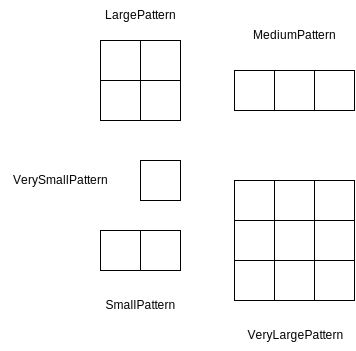

=== Effetti
:pumldir: ./assets/puml
:srcdir: ../
:xrefstyle: short
:figure-caption: Figura
:listing-caption: Listato

Di seguito si discute la rappresentazione e la gestione degli effetti sulla gameboard.
Il sistema si basa sui concetti di effetto e risolutore. Gli effetti esprimono i cambiamenti che sono applicati alla gameboard e incapsulano i parametri necessari per effettuarlo.
I risolutori permettono di risolvere gli effetti e di comporre le modifiche al campo di gioco tramite catene di funzione higher order.
Questo approccio permette di ottenere un sistema flessibile, espandibile e modulare, che facilita l'espansione o la modifica degli effetti senza cambiare la struttura principale del gioco.

In <<game-effect-class-diagram>> sono mostrati i principali effetti di gioco, ovvero:

- *HandEffect*: include i cambiamenti alla mano del giocatore, relativi allo scartare, pescare o giocare carte.
- *PatternEffect*: include i cambiamenti alla griglia, relativi al piazzamento di pattern di token, come fuoco e tagliafuoco.
- *MoveEffect*: include la registrazione delle mosse dei giocatori, relative ad esempio alla scelta di carte da giocare o ripescare.
- *PhaseEffect*: consente la gestione dei cambiamenti della fase di gioco.
- *GameBoardEffect*: rappresenta una sorta di effetto "terminale", ovvero si trova al termine di una catena di funzioni e rappresenta il risultato della mossa di un giocatore. Incapsula la gameboard aggiornata.

[#game-effect-class-diagram]
.Diagramma delle classi che rappresenta i principali effetti di gioco.
[plantuml, card, format="svg"]
----
@startuml
hide empty members
skinparam shadowing false

class HandEffect << (E, orange) >>

class PatternEffect << (E, orange) >>

class MoveEffect << (E, orange) >>

class PhaseEffect << (E, orange) >>

class IGameEffect << (T, lightblue) >>

class GameBoardEffect

HandEffect      --> IGameEffect: extends
PatternEffect   --> IGameEffect: extends
MoveEffect      --> IGameEffect: extends
PhaseEffect     --> IGameEffect: extends
GameBoardEffect --> IGameEffect: extends
@enduml
----

In <<solver-types-class-diagram>> sono mostrati i principali risolutori, ovvero:

- *ISolveGameEffect*: è un'interfaccia generica che riceve in input un effetto e lo traduce in un altro effetto.
- *GameEffectSolver*: rappresenta un'istanza concreta di risolutore che è utilizzata nell'applicazione come intermediario tra altri risolutori o come terminale di una catena di funzioni nel caso restituisca un `GameBoardEffect`.
- *LogicEffectSolver*: è l'istanza di un risolutore specializzata nella restituzione di effetti logici, ovvero degli effetti che saranno poi usati per il calcolo dei pattern.
- *PatternEffectSolver*: è l'istanza di un risolutore specializzata nella restituzione del risultato del calcolo dei pattern.

[#solver-types-class-diagram]
.Diagramma delle classi che rappresenta i risolutori di logica.
[plantuml, solvers, format="svg"]
----
@startuml
hide empty members
skinparam shadowing false
left to right direction

class ISolveGameEffect as "ISolveGameEffect[InputEffect <: IGameEffect, OutputEffect <: IGameEffect]" << (T, lightblue) >>

class GameEffectSolver as "GameEffectSolver[InputEffect <: IGameEffect, OutputEffect <: IGameEffect]"

class LogicEffectSolver as "LogicEffectSolver[CardEffect <: ICardEffect]"

class PatternEffectSolver as "PatternEffectSolver[GameBoardEffect, PatternEffect | GameBoardEffect]"

GameEffectSolver    --> ISolveGameEffect: extends
LogicEffectSolver   --> ISolveGameEffect: extends
PatternEffectSolver --> ISolveGameEffect: extends
@enduml
----

=== Carte
:pumldir: ./assets/puml
:srcdir: ../
:xrefstyle: short
:figure-caption: Figura
:listing-caption: Listato

Di seguito si discute la rappresentazione e la gestione delle carte e dei relativi effetti sul campo di gioco.

Grazie al sistema degli effetti e dei risolutori è stato possibile facilitare l'espansione o la modifica degli effetti senza cambiare la struttura principale del gioco.

Come si può osservare in <<card-types-class-diagram>>, gli effetti delle carte sono stati suddivise in due categorie: standard e speciali. Esistono cinque tipi di effetti, uno per ogni tipologia di carta del gioco:

- *Secchio*: effetto speciale che fa riferimento alle uniche carte che permettono di rimuovere dei token fuoco che si trovano nell'area di una torre;
- *Tagliafuoco*: effetto standard che permette di aggiungere o rimuovere dei tagliafuoco dal campo di gioco. I tagliafuoco impediscono di piazzare dei token fuoco nella posizione in cui si trovano.
- *Fuoco*: effetto standard utilizzato per piazzare dei token fuoco.
- *Acqua*: effetto standard utilizzato per rimuovere i token fuoco che non si trovano nei confini delle torri.
- *Vento*: effetto standard che permette di modificare la direzione del vento o di piazzare un token fuoco.

[#card-types-class-diagram]
.Diagramma delle classi che rappresenta i risolutori di logica.
[plantuml, solvers, format="svg"]
----
@startuml
hide empty members
skinparam shadowing false
left to right direction

class BucketEffect << (E, orange) >>
class FirebreakEffect << (E, orange) >>
class FireEffect << (E, orange) >>
class WaterEffect << (E, orange) >>
class WindEffect << (E, orange) >>

class ISpecialCardEffect << (T, lightblue) >>
class IStandardCardEffect << (T, lightblue) >>
class ICanBeDiscarded << (T, lightblue) >>
class ICannotBeDiscarded << (T, lightblue) >>
class ICanBePlayedAsExtra << (T, lightblue) >>

class ICardEffect << (T, lightblue) >>

IStandardCardEffect --> ICardEffect: extends
ISpecialCardEffect  --> ICardEffect: extends

IStandardCardEffect --> ICanBeDiscarded: extends
ISpecialCardEffect  --> ICannotBeDiscarded: extends
ISpecialCardEffect  --> ICanBePlayedAsExtra: extends

BucketEffect    --> ISpecialCardEffect: extends
FirebreakEffect --> IStandardCardEffect: extends
FireEffect      --> IStandardCardEffect: extends
WaterEffect     --> IStandardCardEffect: extends
WindEffect      --> IStandardCardEffect: extends
----

A ciascuna tipologia sono associate delle proprietà specifiche tramite appositi tratti. In particolare le carte standard possono essere scartate, al contrario delle carte speciali. Inoltre le carte speciali possono essere giocate in aggiunta ad altre azioni del turno.

Esistono due tipologie di effetti che possono essere associate agli effetti di una carta tramite un risolutore: quelli che richiedono di scegliere tra quelli possibili un pattern da applicare, che estendono `PatternLogicEffect`, e quelli che richiedono di effettuare scelte di altro genere, che estendono `IGameChoiceEffect`. La gerarchia completa è mostrata in <<effect-types-class-diagram>>. Si osserva che `IGameChoiceEffect` è utilizzato per rappresentare gli effetti di cambiamento della direzione del vento, ovvero `WindUpdateEffect`.

[#effect-types-class-diagram]
.Diagramma delle classi che rappresenta i risolutori di logica.
[plantuml, solvers, format="svg"]
----
@startuml
hide empty members
skinparam shadowing false

class IGameEffect << (T, lightblue) >>
class IGameChoiceEffect << (T, lightblue) >>
class WindUpdateEffect << (E, orange) >>
class ILogicEffect << (T, lightblue) >>
class PatternLogicEffect

IGameChoiceEffect  --> IGameEffect: extends
ILogicEffect       --> IGameEffect: extends
WindUpdateEffect   --> IGameChoiceEffect: extends
PatternLogicEffect --> ILogicEffect: extends
----

In <<pattern-types>> sono mostrati i possibili pattern riportati dalle carte, che indicano come sono applicati i token sulla griglia.

[#pattern-types]
.Rappresentazione delle tipologie di pattern della griglia.

Gli effetti di applicazione dei pattern delle carte possono essere suddivisi in due categorie principali: effetti difensivi ed effetti offensivi.
Come si osserva in <<logic-effect-types-class-diagram>>, entrambe le tipologie di effetti estendono `ILogicComputation`, dato che incapsulano i parametri richiesti per il calcolo in Prolog.
Ciascuna `ILogicEffect` può essere associato a uno o più di queste computazioni, a seconda della complessità dell'effetto logico associato a una carta.

[#logic-effect-types-class-diagram]
.Diagramma delle classi che rappresenta i risolutori di logica.
[plantuml, solvers, format="svg"]
----
@startuml
hide empty members
skinparam shadowing false

class DefensiveEffect
class OffensiveEffect

class ILogicComputation << (T, lightblue) >>
class ILogicEffect << (T, lightblue) >>

DefensiveEffect --> ILogicComputation: extends
OffensiveEffect --> ILogicComputation: extends
ILogicEffect *-- ILogicComputation
----

Ad esempio in <<fire-effect-listing>> è riportata la definizione delle carte fuoco.
Si osserva l'utilizzo di una enumerazione per associare al tipo di effetto il relativo codice, impiegato in fase di lettura del file delle stringhe in inglese per popolare il titolo e la descrizione di ciascuna carta.

Ciascuna effetto di una carta è poi associato a un ulteriore effetto che definisce i parametri necessari per la sua risoluzione logica, tramite un metodo che funge da risolutore, di tipo `LogicEffectSolver`.

[#fire-effect-listing]
.Frammento di codice relativo alla dichiarazione dei tipi di carta fuoco e dei relativi effetti logici.
[source, scala]
----
include::../scala/it/unibo/model/effect/card/FireEffect.scala[tags=fireEffect]
----

Per effettuare l'associazione tra l'effetto di una carta e i parametri necessari per il calcolo dei possibili punti di applicazione del relativo pattern si utilizza una la given mostrata in <<given-logic-card-effect>>.

[#given-logic-card-effect]
.Frammento di codice relativo alla
[source, scala]
----
include::../scala/it/unibo/model/effect/core/ICardEffect.scala[tags=contextualLogicEffect]
----
